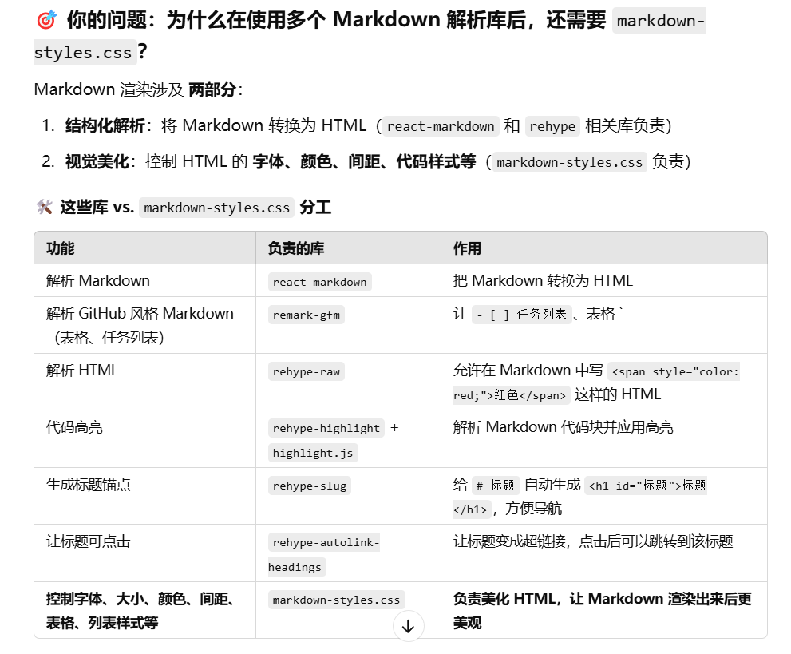

# cyblog开发文档
## MarkdownEditor组件
### 缓存
1. 使用sessionStorage将输入框内容进行缓存，每次组件挂载时从缓存读取内容；每次内容改变时触发更新缓存。
### 上传图片
1. 
### 编辑功能
1. 
### 渲染样式
1. 使用MarkdownRender组件实现预览框的渲染效果
## MarkdownRenderer组件
1. 引用react-markdown、remark-gfm、rehype-raw、rehype-highlight、rehype-slug、rehype-autolink-headings
2. 在styles文件夹中创建markdown-styles.css文件，自定义markdown样式
3. 